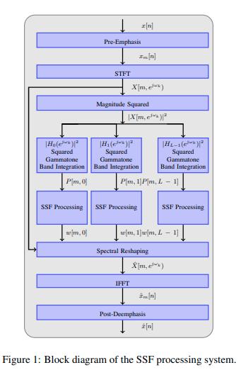

# 特徴量の調査

以下の論文を元に音響特徴量に何があるのか調査する．
- [A Feature Study for Classification-Based Speech Separation at Low Signal-to-Noise Ratios](https://web.cse.ohio-state.edu/~wang.77/papers/CWW.taslp14.pdf)

## Mel-Frequency Cepstram Coefficient (MFCC)
MFCCは音声波形をフーリエ変換（実際にはshort-Time Fourier Transformation: STFT）行い，スペクトログラムを得る．
そのスペクトログラムに対してメルフィルタバンクをかけてメルスペクトログラムに変換する．
メルスペクトログラムから対数パワースペクトルを計算する
得られた対数パワースペクトルに対して離散コサイン変換を行い，得られた係数を係数の次数が低い順に一定数取ると得られる．

## Perceptual Linear Prediction (PLP)
PLPは音声波形をフーリエ変換（実際にはshort-Time Fourier Transformation: STFT）を行い，スペクトログラムを得る．
その後バークフィルタバンクをかけることでバークスペクトログラムに変換する．
その後バーク尺度ごとに重みをかけたあと値を0.33乗する．
最後に線形予測を行い，ケプストラムに変換する．

## RASTA-PLP
PLPを計算する前にRASTAフィルタをかける．

## GammaTone-Frequency Cepstram Coefficient(GFCC)
GFCCは音声波形をフーリエ変換（実際にはshort-Time Fourier Transformation: STFT）行い，スペクトログラムを得る．
そのスペクトログラムに対してガンマトーンフィルタバンクをかけてガンマトーンスペクトログラムに変換する．
ガンマトーンスペクトログラムから対数パワースペクトルを計算する．
得られた対数パワースペクトルに対して離散コサイン変換を行い，得られた係数を係数の次数が低い順に一定数取ると得られる．

## GammaTone-Frequency Modulation Coefficient (GFMC)
GFMCは音声波形に対してガンマトーンフィルタを適用した後に離散コサイン変換を用いる．
その後得られた2次元データに対してある周波数に対する時間方向に並べたデータに対してフーリエ変換をかけて得られるらしい．

## Zero-crossing and peak-anplitude (ZCPA)
ZCPAは音声データを10msごとに分割した後，preemphasisフィルタ，IIRフィルタを適用する．
その後，次のhelf-wave rectification (HWR)に適用する．
$$
y = \begin{cases}
    1 + A\tan^{-1}(Bx) & \text{if} \quad x>0 \\
    \exp(ABx) & \text{if} \quad x>0 \\
\end{cases}
$$
最後にローパスフィルタを適用してAutomatic Gain Controle (AGC) を計算すると得られる．
$$
y = \frac{1}{1+Kx}
$$

## Power Normalized Cepstram Coefficient (PNCC)
PNCCは音声波形に対してSTFTを適用した後
ガンマトーンフィルタを適用する．その後一定時間間隔で時間を区切り，その区間内でノイズ除去を行うためのローパスフィルタを適用する．その後，平均を0にしてDCTをかけると得られる．

## Gabor-FilterBank (GFB) feature
GFBは入力波形から対数メルスペクトルを計算する．その後対数メルスペクトルに対してガボールフィルタを適用する．

## Amplitude Modulation Spectrogram (AMS)
入力波形に対してSTFTを適用してスペクトログラムを得る．そのスペクトログラムに対して絶対値の2乗を計算し，それをバークフィルタバンクにかける．そして得られたデータに対して，時間方向にSTFTをかけることで3次元データを得る．そして対数エネルギーを計算したものがAMSとなる．また，3次元データに対して，単位円上に正規化した後，絶対値の3乗根を計算する方法もある．

## Delta-Spectral Cepstram Coefficient (DSCC)
単純にMFCCに1階微分や2階微分を加えたもの

## Surpression of Slowly-varying Components and Falling Edge of the Power Envelope (SSF)
やっていることがかなり複雑そうなので一旦保留．
流れは次の図の通りらしい．

